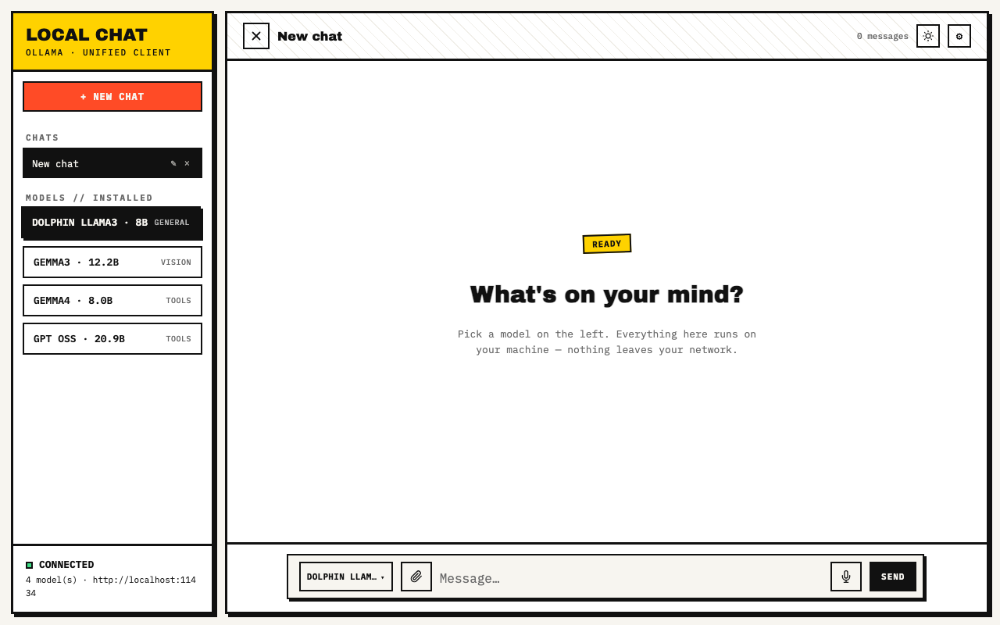
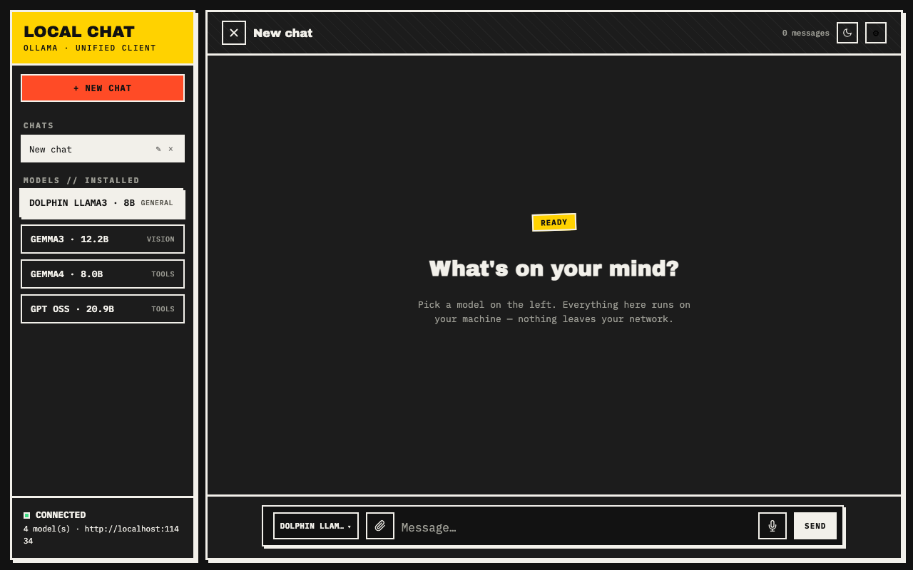

# LOCAL CHAT

A fast, single-file, no-build web UI for [Ollama](https://ollama.com). Chat with any model you've pulled — entirely on your own machine. No account, no cloud, no telemetry, no build step.

<p>
  
  
</p>

## Features

- **Works with any Ollama model** — nothing is hardcoded. Whatever you `ollama pull` shows up in the sidebar automatically, with an auto-generated tag (`VISION`, `CODE`, `EMBED`, `TOOLS`, `HEAVY`/`LIGHT`).
- Multiple chats, persisted locally in your browser — nothing leaves your machine.
- Streaming responses, with a separate "Thinking…" panel for reasoning models (DeepSeek-R1, GPT-OSS, Qwen3, …).
- Image and text/code file attachments, with an automatic warning if your selected model can't actually see images.
- Voice input (Chrome desktop & Android).
- Installable as a PWA — add to your home screen, works offline once loaded.
- **LAN access** — run it on your PC, use it from your phone on the same Wi-Fi.
- Light/dark theme — follows your OS by default, remembers your choice once you override it.
- Collapsible sidebar.
- **Optional web search** — lets a tool-calling model search the web before answering, via a small self-hosted proxy. No API key, no account.
- **Optional MCP bridge** — lets Claude Code (or any MCP client) delegate cheap sub-tasks to your local models.

## Requirements

- [Ollama](https://ollama.com/download), installed and running, with at least one model pulled.
- A modern browser (Chrome, Edge, Safari, Firefox).
- Python 3 — only for the built-in dev server (`start.sh`). You can skip this and open `index.html` directly instead.
- Node.js 18+ — only needed for the optional web-search proxy.

## Quick start

```bash
# 1. Install Ollama, then pull a model
ollama pull llama3.2

# 2. Clone this repo
git clone https://github.com/nibirabeer/LOCAL-CHAT.git
cd LOCAL-CHAT

# 3. Run it
./start.sh
```

Open **http://localhost:8080**, pick a model in the sidebar, and start chatting.

No server needed either — you can just double-click `index.html` to open it directly in your browser, as long as Ollama is running on `localhost:11434`.

> `start.sh` is a bash script (macOS/Linux). On Windows, either run it via WSL/Git Bash, or just run `python3 -m http.server 8080` yourself and open `http://localhost:8080` — the app itself works in any browser regardless of OS.

## Using your own models

There is no model list to edit in the code. To add a model:

```bash
ollama pull <model-name>
```

then reload the page (or hit Settings → Save, which also re-checks the model list). Browse what's available at [ollama.com/library](https://ollama.com/library) — anything from a 1B chat model to a 70B reasoning model works, as long as your machine has the RAM/VRAM for it.

Sidebar tags are inferred automatically, not hand-maintained:

| Tag | Meaning |
|---|---|
| `VISION` | Model can see images (matched by name — gemma3, llava, qwen-vl, moondream, …) |
| `CODE` | Code-focused model |
| `EMBED` | Embedding model |
| `TOOLS` | Supports tool/function calling — read from Ollama's own capability report. Needed for web search. |
| `HEAVY` / `LIGHT` / `GENERAL` | By parameter count |

## Connecting to Ollama on another machine

By default the app talks to `http://localhost:11434`. To point it at Ollama running on a different PC on your network, open **Settings (⚙)** and change the **Ollama server URL**. On that machine, make sure Ollama is listening on all interfaces, not just localhost:

```bash
OLLAMA_HOST=0.0.0.0 ollama serve
```

To use the *app itself* from your phone: run `./start.sh` on your PC and open the LAN URL it prints (same Wi-Fi network required).

## Web search (optional)

Lets a tool-calling model search the web before answering, via `search-proxy.mjs` — a small local proxy that queries DuckDuckGo directly. No API key, no account, no third-party service in between.

1. `./start.sh` already starts the proxy for you (needs Node.js). To run it standalone: `node search-proxy.mjs` (listens on port 8765).
2. Pick a model tagged `TOOLS` in the sidebar.
3. Open **Settings → Web search** and check the box (this is per-chat).
4. Ask something that needs current information — you'll see a "Searching the web for…" status before the model answers.

DuckDuckGo occasionally rate-limits rapid automated requests. If that happens the app tells you plainly (`DuckDuckGo is rate-limiting this IP…`) instead of silently returning nothing — just wait a minute and try again.

## Claude Code / MCP bridge (optional, advanced)

`mcp-server/` is a small [Model Context Protocol](https://modelcontextprotocol.io) server that lets Claude Code (or any MCP-compatible client) delegate cheap, mechanical sub-tasks — summarizing, boilerplate, simple Q&A — to your local Ollama models instead of spending cloud tokens on them.

```bash
cd mcp-server
npm install
```

Then register it with your MCP client, e.g. for Claude Code:

```bash
claude mcp add ollama-bridge -- node /absolute/path/to/LOCAL-CHAT/mcp-server/server.js
```

It exposes two tools: `ask_local_model` (send a prompt to any installed model) and `list_local_models`.

## Data & privacy

Chat history, settings, and your theme choice all live in your browser's `localStorage` — nothing is synced anywhere. The only network traffic this app generates is:

- your prompts, to whichever Ollama server you've configured (your own machine, by default), and
- search queries, to DuckDuckGo, only if you explicitly turn on web search.

## Project structure

```
index.html         the entire app — UI, styling, and logic in one file
search-proxy.mjs    optional local web-search proxy (DuckDuckGo, no deps)
start.sh            dev server + search proxy launcher, with LAN access
gsap.min.js         vendored animation library (sidebar collapse) — self-hosted, no CDN
manifest.json, sw.js  PWA install support + offline caching
mcp-server/         optional MCP bridge for Claude Code (see above)
icons/, gen_icons.py  app icons
```

## Credits

Sidebar animation powered by [GSAP](https://gsap.com) (vendored locally, MIT-compatible free license — no CDN dependency, keeping this app fully offline-capable).

## License

MIT — see [LICENSE](LICENSE).
